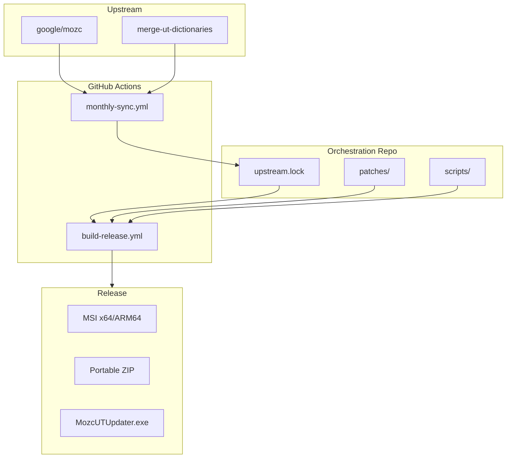
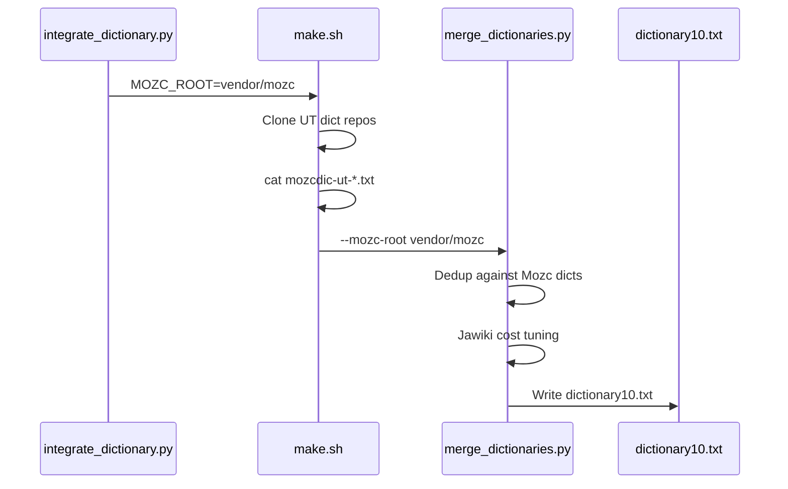
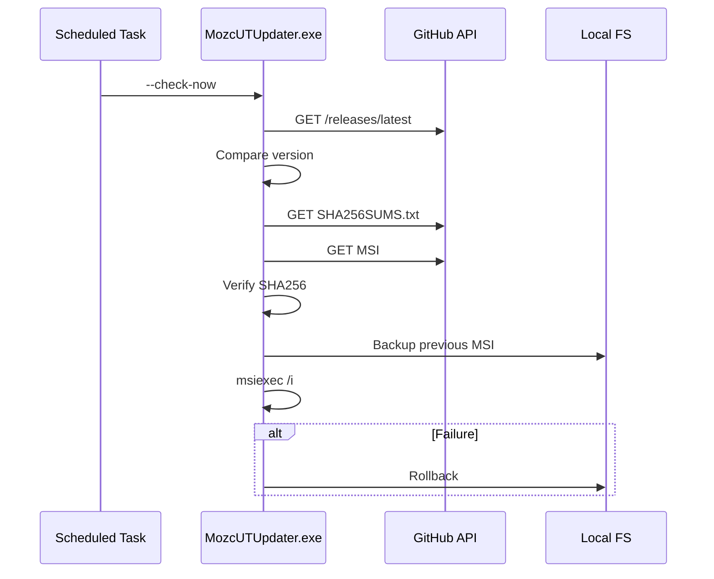

# Architecture

## Overview

Mozc UT Privacy Edition is a standalone orchestration repository that builds an unofficial Windows distribution of Mozc with community UT dictionaries integrated. It is not a long-lived Mozc fork.



## Components

### 1. Vendor Submodules

| Submodule | URL | Purpose |
|-----------|-----|---------|
| `vendor/mozc` | google/mozc | IME engine, Windows TSF, WiX installer |
| `vendor/merge-ut-dictionaries` | utuhiro78/merge-ut-dictionaries | UT dictionary merge pipeline |

SHAs are pinned in `upstream.lock` for reproducible builds.

### 2. Patches

Minimal, repeatable patches applied by `scripts/apply_patches.py`:

| Patch | Purpose |
|-------|---------|
| `patches/mozc/0001-branding.patch` | Product branding, installer metadata, license bundling |
| `patches/mozc/0002-new-files.patch` | Placeholder dictionary10.txt and license files |
| `patches/merge-ut/0001-local-mozc-root.patch` | `--mozc-root` flag for local Mozc dedup |

### 3. Dictionary Integration



UT entries are stored in `dictionary10.txt` (not appended to `dictionary00.txt`) and included in the Bazel `base_dictionary_data` filegroup.

### 4. Build Pipeline

Windows builds use the upstream Mozc Bazel pipeline:

```
update_deps.py → build_qt.py → bazelisk build package
```

Two matrix builds: x64 (default) and ARM64 (`--platforms=//:windows-arm64`).

### 5. Release Artifacts

| Artifact | Source |
|----------|--------|
| MSI | `bazel-bin/win32/installer/MozcUTPrivacy64.msi` |
| Portable ZIP | `scripts/package_portable.ps1` |
| Updater | `updater/` built with CMake |
| Checksums | `scripts/generate_checksums.ps1` |
| Release notes | `scripts/generate_release_notes.py` |

### 6. Auto-Update System

The updater is a **standalone C++ binary** using WinHTTP. It is not part of the IME process.



Configuration: `%ProgramData%\MozcUTPrivacy\updater.json`

### 7. License Compliance

Single source of truth: `licenses/manifest.yaml`

Generated outputs (bundled in every release):

- `LICENSES.txt` — Primary license summary
- `THIRD_PARTY_LICENSES.txt` — Full license texts
- `CREDITS.txt` — Attribution list

CI gate: `python scripts/generate_licenses.py --check`

### 8. Upstream Sync

Monthly cron (`0 0 1 * *` UTC):

1. Fetch latest SHAs from GitHub API
2. Compare with `upstream.lock`
3. If changed: update lock, commit, create tag `v{mozc_ver}.{YYYYMMDD}`
4. Tag push triggers `build-release.yml`

## Security Considerations

- IME processes make zero network requests
- Updater verifies SHA256 before install
- Rollback on failed installation
- No telemetry or analytics anywhere
- Supply chain pinned by `upstream.lock`
- Optional Authenticode signing for release artifacts

## Key Files

| File | Role |
|------|------|
| `upstream.lock` | Pinned upstream SHAs |
| `scripts/prepare_build.py` | Full pre-build preparation |
| `scripts/sync_upstream.py` | Monthly upstream sync |
| `scripts/integrate_dictionary.py` | Dictionary merge orchestration |
| `scripts/generate_licenses.py` | License bundle generation |
| `.github/workflows/build-release.yml` | Release CI/CD |
